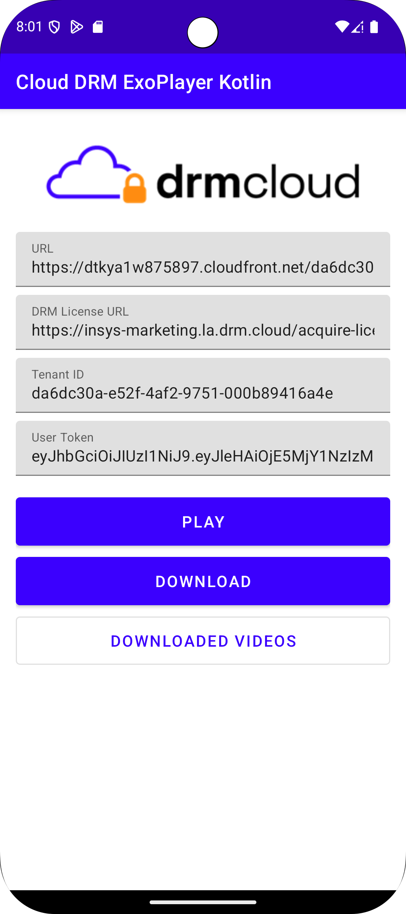
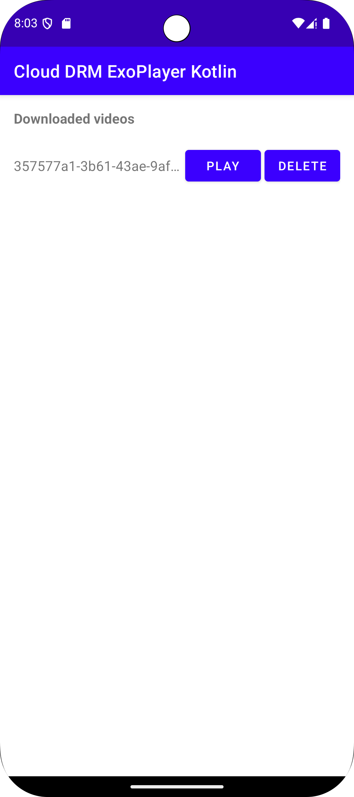

# ExoPlayer with Cloud DRM in Kotlin or Java

This project demonstrates how to implement DRM (Digital Rights Management) playback for Kotlin and Java using ExoPlayer in Android application, with additional support for offline content downloading exclusively in Kotlin.

The application features a dynamic configuration form, allowing you to test different DASH streams and license configurations instantly without recompiling the code.

## Overview

The application provides a user-friendly interface to test secure video playback. Above the configuration form, you will find the **Cloud DRM logo**, which links to the Cloud DRM serverless digital rights management solution website.

The main form includes four required fields for the user to fill:

* **URL:** The link to the MPEG-DASH manifest (`.mpd`).
* **DRM License URL:** The license server endpoint.
* **Tenant ID:** Your 36-character tenant identifier.
* **User Token:** The authorization token for license acquisition.

You can obtain those via [Cloud Video Kit web console](https://console.videokit.cloud/).  
More information about the structure of the token and how to generate it can be found in [Cloud DRM documentation](https://docs.videokit.cloud/developers/cloud-drm/license-acquisition/token).

## Usage

### Testing Streams

1. **Form Validation:** Enter your data. The `URL` and `DRM License URL` fields must start with `http://` or `https://` and cannot be empty. The `Tenant ID` must be exactly 36 characters, and also the `User Token` field is required.
2. **Validation Feedback:** After pressing **PLAY**, the app validates the inputs. If a field fails, a **red exclamation mark** appears next to it. Click the icon to see the specific reason for failure.
3. **Connectivity:** If the device has no internet connection when **PLAY** is pressed, a "No internet connection" message appears at the bottom of the screen, and the player will not launch.
4. **Player Controls:** Once the player launches, it supports play, pause, return to start, and 15-second skip forward/backward.

## Offline DRM Scenario

The application includes a specialized workflow for testing downloadable content-protected MPEG-DASH. This section uses the **DOWNLOAD** and **DOWNLOADED VIDEOS** buttons located below the form.

### 1. Downloading Content

When you press **DOWNLOAD**, the app performs the same field validation and internet check as the playback mode.

* **Notification Permission:** The app will ask for permission to show notifications. This allows you to track download progress in the system tray even if the app is in the background. If denied, the download still proceeds without the system notification.
* **Duplicate Check:** The app checks its local database using the Video ID (extracted from the URL after `assets/`). If the video is already saved or currently being downloaded, a new process will not start.
* **License Acquisition:** The process first fetches the **keySetId** (the offline DRM license).
* **Error:** If license acquisition fails, an "Error while downloading DRM license" message appears.
* **Success:** A message "DRM license for {mediaId} downloaded and saved" appears.

* **Media Download:** A progress bar and status window appear between the form and buttons. Once finished, you will see "Download completed. Saving…", and the data is stored in the local database.
* **Cancellation:** While a download is active, the **DOWNLOAD** button changes to **CANCEL**.

### 2. Managing Downloaded Videos

Tap **DOWNLOADED VIDEOS** to see a list of saved content.

* If the database is empty, the screen will display "No downloaded videos."
* Each list item contains the Video ID and two buttons: **PLAY** and **DELETE**.

### 3. Offline Playback Logic

The app automatically manages the DRM configuration based on your connection status:

* **Offline Mode:** If the device is offline or in Airplane Mode, pressing **PLAY** triggers playback using the stored **keySetId**. ExoPlayer decrypts the video locally using the keys saved in a secure location, without contacting the license server.
* **Online Mode:** If an internet connection is available, the app defaults to online playback.

### 4. Deleting Content

The **DELETE** button physically removes the video file from the device's memory and clears the metadata and license from the local database, enabling the video to be downloaded again.

## License

This project is licensed under the [MIT License](LICENSE).

## Acknowledgements

[ExoPlayer](https://github.com/google/ExoPlayer) - An open-source media player library for Android.  
[Cloud DRM docs](https://docs.videokit.cloud/developers/cloud-drm) - Cloud DRM documentation.  