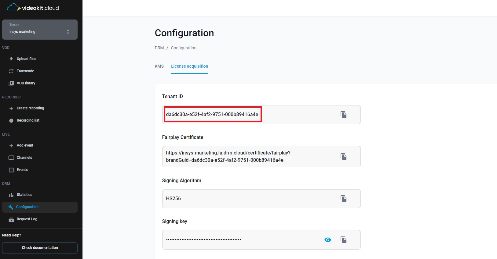

# ExoPlayer with Cloud DRM in Kotlin or Java

This project demonstrates how to implement DRM (Digital Rights Management) playback in an Android application using both Kotlin and Java programming languages with the ExoPlayer.

## Overview

This is an Android application written in Kotlin / Java that demonstrates how to use ExoPlayer to play DRM-protected content using DASH (Dynamic Adaptive Streaming over HTTP). The code initializes an ExoPlayer instance, sets up the necessary data sources and media items, and prepares the player for playback.

## Prerequisites

To run this code, you need the following prerequisites:
  - Android development environment
  - Knowledge of Kotlin and Java programming languages
  - ExoPlayer library
  - Access to Cloud DRM (via Cloud Video Kit web console) to obtain: 
    - `URL` - The url to the MPEG-DASH manifest of the video
    

    - `DRM_LICENSE_URL` - License server url
    

    - `x-drm-brandGuid` - Tenant ID in the Cloud Video Kit
    

    - `x-drm-userToken` - A token that allows you to issue a license to play drm material. <br>[More information about the structure of the token and how to generate it can be found here](https://developers.drm.cloud/licence-acquisition/licence-acquisition)
    ```json
    {
      "exp": 1893456000, 
      "drmTokenInfo": {
        "exp": "2030-01-01T00:00:00+00:00", 
        "kid": ["1f83ae7f-30c8-4ad0-8171-2966a01b6547"], 
        "p": { 
          "pers": false 
        }
      }
    }
    ```

## Getting Started

1. Clone the repository or download the source code.
2. Open the project in your preferred Android development environment.
3. Replace the `URL` and `DRM_LICENSE_URL` constants in MainActivity with the actual media URL and DRM license server URL based on your chosen programming language (Kotlin or Java).
4. Set the `x-drm-brandGuid` and `x-drm-userToken` headers in the `httpHeaders` map in MainActivity. Replace the placeholder values with your specific tenant identifier and authorization token for the DRM licensing process.
5. Build and run the application on an Android device or emulator.

## Methods description

The `MainActivity` class contains the main logic of the application. Here's an overview of its methods:
- `onCreate()`: Initializes the player and sets up the user interface.
- `releasePlayer()`: Releases the player resources when the activity is stopped, paused, or destroyed.
- `initializePlayer()`: Sets up the ExoPlayer instance, data sources, media items, and prepares the player for playback.

## Usage

1. Launch the application on an Android device or emulator.
2. The player view will be displayed, and the media playback will start automatically.
3. The player view supports standard media playback controls like play, pause, seek, and stop.
4. To handle the player's lifecycle, the player view is automatically managed in the MainActivity class. It starts, resumes, pauses, stops, and destroys the player view based on the activity lifecycle events.

## License

This project is licensed under the [MIT License](LICENSE).

## Acknowledgements

[ExoPlayer](https://github.com/google/ExoPlayer) - An open-source media player library for Android.
